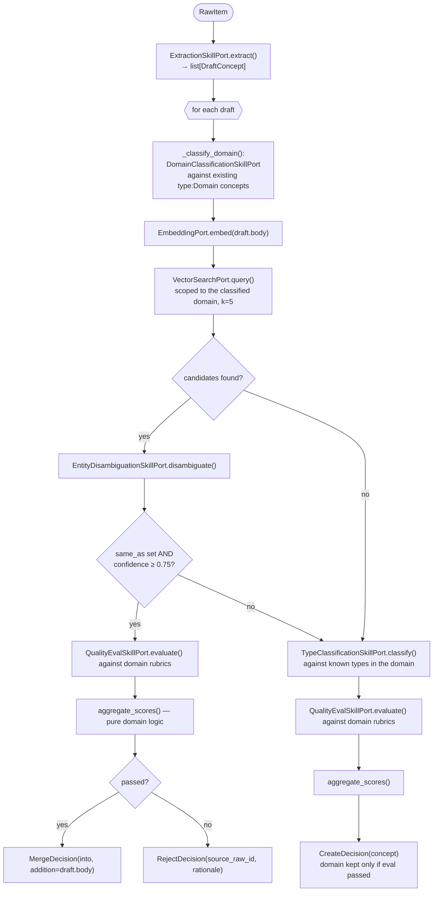
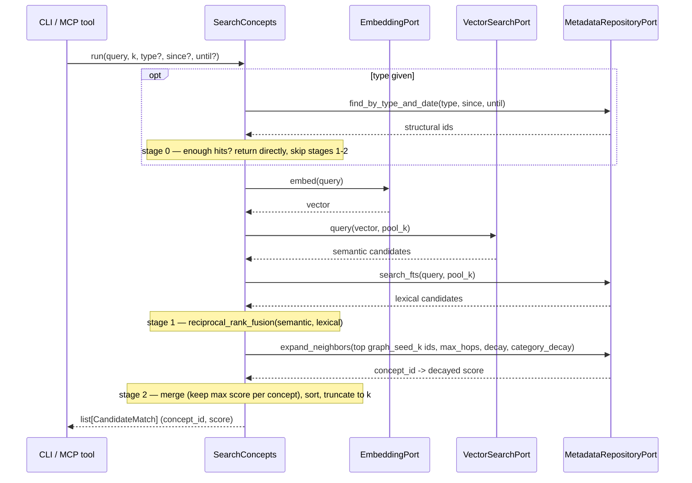

# Data Flow

This traces what actually happens, module by module, for the two flows that
matter most: turning capture-inbox material into vault concepts
(`scan` → `parse-sources` → `ingest` → `index`), and answering a search query.
Both are driven from `cli/main.py`, but the orchestration itself lives
entirely in `application/use_cases/`.

## End-to-end ingestion

### 1. `pipeline scan` → `ScanIntake`

Walks `vault/raw/` via `FileSystemScannerPort.scan()`, which SHA-256-hashes
every file's content (the hash **is** the item's `id` — stable identity
independent of path). For each file: `classify_kind(path)` maps the extension
to `RAW_NOTE` or `SOURCE_DOCUMENT` (unrecognized extensions are skipped
entirely); if an `IntakeItem` already exists at that path with the same
content hash, it's unchanged and skipped; otherwise a new `IntakeItem` is
`upsert()`ed in state `discovered`. This step never reads file *content*
beyond hashing — it only registers what exists.

**When a path's content changes** (same file edited/replaced, new hash), the
old `IntakeItem` for that path is only kept around if something was actually
done with it — `parsed`, `ingested`, or `rejected` are historical record and
survive untouched. If it was still sitting in `discovered` or `error`
(nothing was ever derived from it), `ScanIntake` deletes it before
registering the new hash, rather than leaving an orphaned row behind forever.

### 2. `pipeline parse-sources` → `ParseSourceDocuments`

Only touches `IntakeItem`s of kind `SOURCE_DOCUMENT` in state `discovered`.
The first time a given source document is parsed, `_ensure_source_hub`
creates a durable stub concept for it under `vault/references/` (`type:
Source Document`, idempotent across re-parses — checked via
`IntakeRepositoryPort.list_concepts_for(source.id)`, the same chunk↔concept
link table reused for source↔hub). This hub is what step 3 below points
every derived concept's §5.1 `sources[]` at.

For each source: `DocumentParsingPort.parse(path)` (Docling) returns markdown
text plus any extracted `ParsedImage`s; each image is captioned via
`ImageCaptioningSkillPort` and its placeholder anchor in the text is replaced
with `[image: <caption>]`. The resulting text is split with
`chunk_markdown()`; each chunk that `domain/text_quality.py::
looks_like_garbled_table` flags as a mangled table dump (rather than prose —
e.g. a Docling table-parse artifact) is skipped, counted in
`ParseOutcome.skipped`, and never registered. Everything else becomes its
own DB-only `IntakeItem` of kind `CHUNK` (`content` set, `path` is `None`,
`parent_id` points back at the source document). The source document itself
transitions to state `parsed`. A chunk is still indistinguishable from a raw
note by the time it reaches `KnowledgeAgent`'s decision-making — the one
exception is `RawItem.source_id` (the chunk's `parent_id`), read only by
`IngestRawMaterial` for provenance stamping, never by `KnowledgeAgent` itself.

### 3. `pipeline ingest` → `IngestRawMaterial`

Pulls every unprocessed item via `RawMaterialRepositoryPort.list_unprocessed()`
(which covers both `RAW_NOTE` and `CHUNK` kinds), and for each one:

1. Runs it through `KnowledgeAgent.run(raw)` — see below — getting back an
   `AgentResult` of `CreateDecision` / `MergeDecision` / `RejectDecision`s.
   Also resolves `source_concept_id = RawMaterialRepositoryPort.
   find_source_concept(raw.source_id)` once (`None` for a plain raw note, or
   a chunk whose source document hasn't produced a hub yet).
2. For each `CreateDecision`: slugifies a title into a `ConceptId`
   (de-duplicating with a numeric suffix if the slug is already taken). If
   `source_concept_id` is set, stamps a §5.1 `sources[]` entry pointing at
   it (deduped by resource). Builds the `Concept`, `save()`s it via
   `ConceptRepositoryPort`, indexes it via `IndexConcept`, and appends a
   `create` entry to the SQLite audit log (`BundleLogPort`). Then:
   - for each `CreateDecision.related` entry (existing concepts the new one
     was judged related to — see §4 below), writes a reciprocal backlink into
     *that* existing concept's own body too (`domain/linking.py::
     add_related_links`, deduped/idempotent), re-indexes it, and appends a
     `relate` entry to the audit log. Bounded to the handful of candidates
     already judged related — no full-vault rescan — and is what keeps
     relatedness from being one-directional: an old concept created before
     anything related to it existed still ends up linked, once something
     related is later ingested.
   - if `source_concept_id` is set, also updates that hub's own body with a
     link to the new concept under `## Derived concepts`
     (`domain/linking.py::add_link_section`, same dedup/idempotent shape),
     re-indexes it, and appends a `derive` entry to the audit log.
3. For each `MergeDecision`: loads the target concept, stamps `sources[]`
   the same way if `source_concept_id` is set, inserts the addition into its
   body via `domain/linking.py::insert_before_related` (before any trailing
   `## Related` section, so merges never push it out of position), saves and
   re-indexes it, appends a `merge` entry to the audit log, and — same as
   for creates — updates the source hub's `## Derived concepts` list
   (deduped, so repeated merges from the same source into the same concept
   don't accumulate duplicate entries).
4. For each `RejectDecision`: appends a `reject` entry to the audit log — no
   vault change.
5. Marks the raw item `mark_processed()` (or `mark_rejected()` if *every*
   decision for it was a rejection and nothing was created or merged).

**`## Related` invariant:** when present, `## Related` is always the *last*
section of a concept's body — enforced everywhere the body is mutated after
creation (`insert_before_related` for merge additions, `add_related_links`
for both the initial forward links and later reciprocal backlinks, both in
`domain/linking.py`). The same invariant holds for a source-document hub's
`## Derived concepts` section, via the same `add_link_section` helper.

### 4. `KnowledgeAgent.run(raw)` — the judgment pipeline

This is the orchestration-heavy core, one raw item in, one `AgentResult` out.
It runs every LLM-backed skill in a fixed order, with deterministic domain
logic deciding what happens between calls:

Key decisions worth calling out explicitly, since they're easy to miss
reading the code linearly:

- **Domain classification runs before vector search**, and the vector search
  is scoped to that domain (`where={"domain": str(domain)}`) when one was
  found. A draft never gets merged into a concept from a different domain.
- **The disambiguation confidence threshold is `0.75`**
  (`DEFAULT_DISAMBIGUATION_CONFIDENCE_THRESHOLD` in `knowledge_agent.py`) —
  below it, the draft is treated as genuinely new and proceeds to type
  classification instead of merging.
- **Quality-eval failure never blocks concept creation.** For a
  `CreateDecision`, a failed eval only sets `frontmatter.domain = None` —
  the concept is still written, just left as an unvalidated, domain-less node
  a future orphan-detection pass could find. Rejection (`RejectDecision`) is
  reserved for the merge path only: an addition that fails eval is dropped
  rather than corrupting an existing, presumably-good concept.
- **`MOC`, `Domain`, `Source Document`, and `Category` types never appear as
  disambiguation candidates** — see `domain/concept.py::NON_CONTENT_TYPES`
  (also used by `AuditConceptQuality` to skip structural concepts) — because
  they're structural/navigation concepts, not content a draft could
  plausibly duplicate.
- **Category classification runs after domain classification and eval, on
  the create path only** (`KnowledgeAgent._classify_categories`) — it's
  skipped entirely when no domain was accepted (`final_domain is None`),
  since there's no domain-scoped category vocabulary to classify against.
  `CategoryClassificationSkillPort` is offered every existing `type:
  Category` concept under that domain (`find_ids_by_type("Category",
  domain=...)`) and returns zero or more existing matches plus optionally
  new category titles. Existing matches are woven into the draft's body as
  `## Categories` links immediately (mirroring how `## Related` links are
  woven in); new titles are carried on `CreateDecision.new_categories` for
  `IngestRawMaterial` to materialize — `KnowledgeAgent` never writes
  anything itself. Concepts that predate this feature get backfilled via
  `pipeline categorize` (`CategorizeConcepts`), which runs the identical
  classify-then-link logic across the whole vault. See CLAUDE.md's
  "Categories" section for the ontology's shape (a forest rooted at
  Domains) and how it feeds `SearchConcepts`' graph-expansion stage.
- **On a `CreateDecision`, the same vector-search candidates get a second,
  separate judgment** — but only the ones scoring at or above
  `RELATEDNESS_MIN_SCORE` (default `0.5`) ever reach it, so a sparsely
  populated domain can't hand the model weak matches to rationalize a link
  for. `RelatednessSkillPort.judge()` decides which of those are genuinely
  related (not the same entity, but worth a reader following a link to) —
  and isn't told the similarity score, so it has to justify from actual
  content, not "these seem similar." Any it picks become real §6
  bundle-relative links woven into the new concept's body under a
  `## Related` heading, *and* a reciprocal backlink written into each
  existing related concept's own body (see step 2 above). This is how
  clusters of related concepts emerge symmetrically in the link graph
  instead of relying on flat `tags` or on creation order.

### 5. `pipeline index` / `IndexConcept` — what gets embedded and where

`IndexConcept.run(concept)` is called both from `IngestRawMaterial` (one
concept at a time, as things change) and from `RebuildIndex` (every concept
in the vault, in a loop — used to recover from a stale or corrupted index).
For any concept whose `type` is not in `NON_CONTENT_TYPES` (`MOC`, `Domain`,
`Source Document`, `Category`): embed the body via `EmbeddingPort`, and
`upsert()` into `VectorSearchPort` with metadata `{"type": ..., "domain":
...}` (domain omitted if absent — Chroma metadata values can't be `None`).
**Every** concept, content or not, is also `upsert()`ed into
`MetadataRepositoryPort` — domain classification needs
`find_ids_by_type("Domain")` to enumerate domains, and category
classification needs `find_ids_by_type("Category", domain=...)`, both of
which would break if those types were excluded from the metadata store too.
`Category` concepts are excluded from vector search the same way `Domain`
concepts are (they're structural hubs, not content to match a draft
against), but they very much participate in the **link graph** —
`SearchConcepts`' graph-expansion stage (see Search, above) walks through
them like any other concept.

## Search

`SearchConcepts` is a three-stage pipeline. Stage 0 is a deterministic
structured prefilter ("ontology-first") that short-circuits the rest when a
caller passes `type` (optionally with `since`/`until`) and it finds enough
matches. Otherwise: stage 1 fuses independent semantic (vector) and lexical
(SQLite FTS5) rankings via reciprocal rank fusion (RRF); stage 2 expands
from the fused ranking's top hits through the concept link graph, decayed by
hop distance, and merges that into the final ranking.

A few things worth knowing:

- **`score` is no longer a single homogeneous 0–1 cosine similarity.** A
  result's score is either its fused RRF value or its hop-decayed graph
  score, depending on which stage found it — treat it as a ranking signal,
  not an absolute similarity measure.
- **Lexical search** (`MetadataRepositoryPort.search_fts`) runs against a
  standalone `concepts_fts` FTS5 table, kept in sync with `upsert`/`delete`
  the same way the `links` table already is. Free-text queries are
  sanitized into a safe OR-of-quoted-terms `MATCH` expression before
  reaching SQLite, since raw input can otherwise collide with FTS5's own
  query syntax (`"`, `AND`/`OR`/`NOT`, `-`, `*`).
- **Graph expansion** (`MetadataRepositoryPort.expand_neighbors`) walks the
  same `links` table `related_concepts`/`find_links` already use, but
  multi-hop and score-decayed: each hop away from a seed multiplies the
  running score by `graph_decay` (default 0.5) — or by the higher
  `graph_category_decay` (default 0.85) for any hop leaving a `type:
  Category` concept, since a shared category is a stronger topical signal
  than an arbitrary body link (see the Category concept type, once
  documented). Seeds themselves are excluded from the graph leg's results.
  A concept found in both stage 1 and stage 2 keeps the larger of its two
  scores rather than summing them, since the two scores aren't on
  comparable scales.
- **Stage 0's structural match returns `score=1.0` for every hit** — they're
  exact structural matches, not similarity-ranked, so there's no meaningful
  score to compute. It only fires when `type` is passed and the hit count
  clears `search_structured_min_results` (default `3`); otherwise the query
  falls through to the hybrid pipeline unfiltered by `type` (stages 1-2
  don't currently take a type constraint of their own).

Both `pipeline search` (CLI, `--type`/`--since`/`--until` flags) and the
`search_wiki` MCP tool call `SearchConcepts` directly — see
[Reference → MCP server](../reference/mcp-server.md).

### Typed relations and lineage traversal

Separate from the graph-expansion signal above, `MetadataRepositoryPort`
also tracks **typed** edges — a Dataview-style inline field
(`relation_type:: [[target]]`) in a concept's body, e.g. `supersedes::
[[/decisions/old-decision]]` — in a dedicated `typed_links` SQLite table
(`from_id, to_id, relation_type`), alongside the plain `links` table every
typed link also lands in (see CLAUDE.md's "Typed relations" section for the
convention itself). `TraceLineage` (`pipeline lineage`, the `trace_lineage`
MCP tool) walks these edges up to `max_hops` away, returning every path
found — not just whether one exists — so a caller can reconstruct a chain
like decision → superseded_by → decision. `find_relations` (the MCP tool of
the same name) returns one concept's typed edges directly, the typed
counterpart to `related_concepts`/`find_links`.

## Validation (structural, not the same as quality-eval)

`pipeline validate <path>` runs `ValidateConcept`, which is unrelated to the
`KnowledgeAgent`'s quality-eval skill — this checks a document's **shape**,
not whether its content is *good*:

1. `ConformanceChecker.check(concept)` — the OKF §11 structural rules (see
   [Domain model](domain-model.md#trust-lifecycle-and-conformance)).
2. `SchemaRegistryPort.get_schema(concept.frontmatter.type)` — looks up
   `<Type>.schema.json`, falling back to `_base.schema.json` — and validates
   `Frontmatter.to_dict()` against it with `jsonschema.Draft202012Validator`.

Both sets of issues are combined into one `ValidationResult`.
