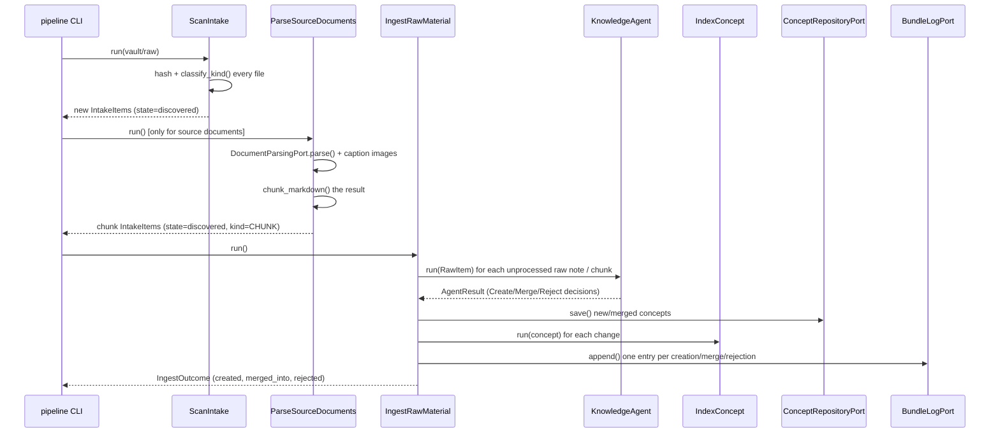
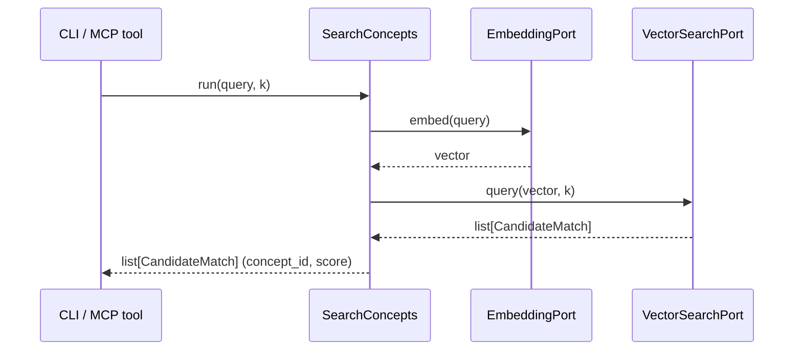

# Data Flow

This traces what actually happens, module by module, for the two flows that
matter most: turning capture-inbox material into vault concepts
(`scan` → `parse-sources` → `ingest` → `index`), and answering a search query.
Both are driven from `cli/main.py`, but the orchestration itself lives
entirely in `application/use_cases/`.

## End-to-end ingestion

### 1. `pipeline scan` → `ScanIntake`

Walks `vault/raw/` via `FileSystemScannerPort.scan()`, which SHA-256-hashes
every file's content (the hash **is** the item's `id` — stable identity
independent of path). For each file: `classify_kind(path)` maps the extension
to `RAW_NOTE` or `SOURCE_DOCUMENT` (unrecognized extensions are skipped
entirely); if an `IntakeItem` already exists at that path with the same
content hash, it's unchanged and skipped; otherwise a new `IntakeItem` is
`upsert()`ed in state `discovered`. This step never reads file *content*
beyond hashing — it only registers what exists.

### 2. `pipeline parse-sources` → `ParseSourceDocuments`

Only touches `IntakeItem`s of kind `SOURCE_DOCUMENT` in state `discovered`.
For each: `DocumentParsingPort.parse(path)` (Docling) returns markdown text
plus any extracted `ParsedImage`s; each image is captioned via
`ImageCaptioningSkillPort` and its placeholder anchor in the text is replaced
with `[image: <caption>]`. The resulting text is split with
`chunk_markdown()`, and each chunk becomes its own DB-only `IntakeItem` of
kind `CHUNK` (`content` set, `path` is `None`, `parent_id` points back at the
source document). The source document itself transitions to state `parsed`.
By design, a chunk is indistinguishable from a raw note by the time it
reaches ingestion — no downstream code needs to know where it came from.

### 3. `pipeline ingest` → `IngestRawMaterial`

Pulls every unprocessed item via `RawMaterialRepositoryPort.list_unprocessed()`
(which covers both `RAW_NOTE` and `CHUNK` kinds), and for each one:

1. Runs it through `KnowledgeAgent.run(raw)` — see below — getting back an
   `AgentResult` of `CreateDecision` / `MergeDecision` / `RejectDecision`s.
2. For each `CreateDecision`: slugifies a title into a `ConceptId`
   (de-duplicating with a numeric suffix if the slug is already taken),
   builds a `Concept`, `save()`s it via `ConceptRepositoryPort`, indexes it
   via `IndexConcept`, and appends a `**Creation**` line to `log.md`.
3. For each `MergeDecision`: loads the target concept, appends the addition
   to its body, saves and re-indexes it, and appends an `**Update**` line to
   `log.md`.
4. For each `RejectDecision`: appends a `**Rejected**` line to `log.md` — no
   vault change.
5. Marks the raw item `mark_processed()` (or `mark_rejected()` if *every*
   decision for it was a rejection and nothing was created or merged).

### 4. `KnowledgeAgent.run(raw)` — the judgment pipeline

This is the orchestration-heavy core, one raw item in, one `AgentResult` out.
It runs every LLM-backed skill in a fixed order, with deterministic domain
logic deciding what happens between calls:

Key decisions worth calling out explicitly, since they're easy to miss
reading the code linearly:

- **Domain classification runs before vector search**, and the vector search
  is scoped to that domain (`where={"domain": str(domain)}`) when one was
  found. A draft never gets merged into a concept from a different domain.
- **The disambiguation confidence threshold is `0.75`**
  (`DEFAULT_DISAMBIGUATION_CONFIDENCE_THRESHOLD` in `knowledge_agent.py`) —
  below it, the draft is treated as genuinely new and proceeds to type
  classification instead of merging.
- **Quality-eval failure never blocks concept creation.** For a
  `CreateDecision`, a failed eval only sets `frontmatter.domain = None` —
  the concept is still written, just left as an unvalidated, domain-less node
  a future orphan-detection pass could find. Rejection (`RejectDecision`) is
  reserved for the merge path only: an addition that fails eval is dropped
  rather than corrupting an existing, presumably-good concept.
- **`MOC` and `Domain` types never appear as disambiguation candidates** — see
  `IndexConcept`'s `_NON_CONTENT_TYPES` — because they're structural/navigation
  concepts, not content a draft could plausibly duplicate.

### 5. `pipeline index` / `IndexConcept` — what gets embedded and where

`IndexConcept.run(concept)` is called both from `IngestRawMaterial` (one
concept at a time, as things change) and from `RebuildIndex` (every concept
in the vault, in a loop — used to recover from a stale or corrupted index).
For any concept whose `type` is not `MOC` or `Domain`: embed the body via
`EmbeddingPort`, and `upsert()` into `VectorSearchPort` with metadata
`{"type": ..., "domain": ...}` (domain omitted if absent — Chroma metadata
values can't be `None`). **Every** concept, content or not, is also
`upsert()`ed into `MetadataRepositoryPort` — domain classification needs
`find_ids_by_type("Domain")` to enumerate domains, which would break if
`Domain` concepts were excluded from the metadata store too.

## Search

`SearchConcepts` is deliberately the thinnest use case in the codebase: embed
the query, query the vector store, return the matches. Both `pipeline
search` (CLI) and the `search_wiki` MCP tool call it directly with no
additional logic layered on top — see
[Reference → MCP server](../reference/mcp-server.md).

## Validation (structural, not the same as quality-eval)

`pipeline validate <path>` runs `ValidateConcept`, which is unrelated to the
`KnowledgeAgent`'s quality-eval skill — this checks a document's **shape**,
not whether its content is *good*:

1. `ConformanceChecker.check(concept)` — the OKF §11 structural rules (see
   [Domain model](domain-model.md#trust-lifecycle-and-conformance)).
2. `SchemaRegistryPort.get_schema(concept.frontmatter.type)` — looks up
   `<Type>.schema.json`, falling back to `_base.schema.json` — and validates
   `Frontmatter.to_dict()` against it with `jsonschema.Draft202012Validator`.

Both sets of issues are combined into one `ValidationResult`.
