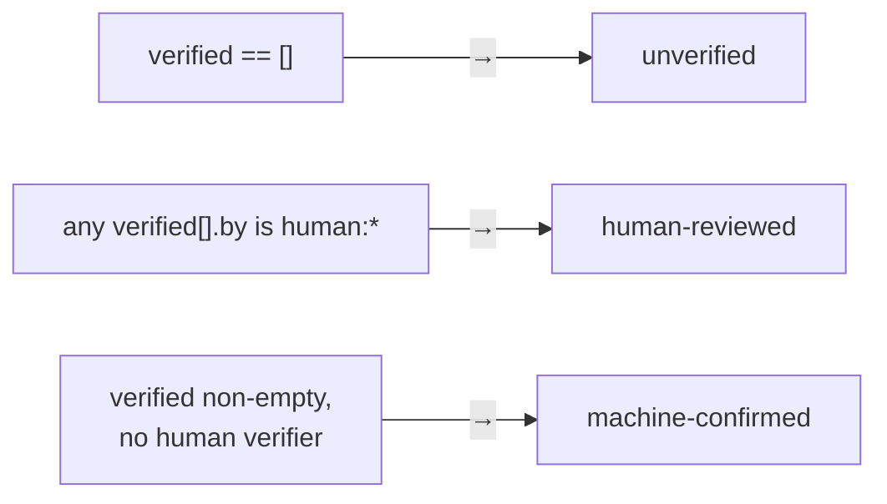
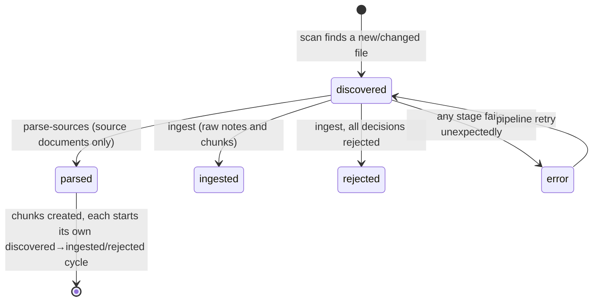

# Domain Model

Everything on this page lives under `src/pipeline/domain/` — pure dataclasses,
enums, and functions with no I/O and no dependency on `application/` or
`adapters/`. Where a type maps directly onto an OKF spec section, the section
is called out; those are also inline comments in the source.

## The concept model (`domain/concept.py`)

The core OKF types, per `../WIKI_SPEC.md` §2/§4/§5/§7:

| Type | Shape | Notes |
|---|---|---|
| `ConceptId` | `frozen`, wraps `value: str` | A concept's bundle-relative path with `.md` stripped. Rejects empty strings and anything still ending in `.md`. |
| `Actor` | `frozen`, wraps `value: str` | `<producer>/<version>` / `human:<id>` / `process:<id>` (§7). `.is_human` checks the `human:` prefix — this is what trust-tier derivation keys off. |
| `Source` | `frozen` | One `sources[]` entry (§5.1): `resource`, plus optional `id`, `title`, `author`, `usage_count`, `last_modified`. |
| `VerificationEvent` | `frozen` | One `verified[]` entry (§5.2): `by: Actor`, `at: datetime`. |
| `Generated` | `frozen` | `generated` block (§5.2): `by: Actor`, `at: datetime \| None`. |
| `Frontmatter` | mutable `@dataclass` | The full YAML frontmatter (§4.1). `type` is the only required field — everything else defaults to `None`/empty. Unknown keys land in `.extra` rather than being dropped (§11: consumers must tolerate unrecognized keys). |
| `Concept` | mutable `@dataclass` | `id: ConceptId`, `frontmatter: Frontmatter`, `body: str` — one markdown document. |

`Frontmatter.to_dict()` produces a plain, JSON-Schema-validatable dict of the
always-present fields plus `.extra` — this is what `ValidateConcept` feeds to
`jsonschema`, decoupling schema validation from the dataclass's exact shape.

## Trust, lifecycle, and conformance

These three modules turn the optional frontmatter families from §5 into
deterministic verdicts — no LLM involved.

**`domain/trust.py`** — `TrustTier` (`unverified` / `machine-confirmed` /
`human-reviewed`) derived from `Frontmatter.verified` (§5.3):

**`domain/lifecycle.py`** — two independent, absent-means-safe rules (§5.4,
§5.5): `effective_status(status)` maps an absent `status` to `Status.STABLE`;
`is_stale(stale_after, today)` is `True` only once `today >= stale_after`, and
`False` when `stale_after` is absent (never stale).

**`domain/conformance.py`** — `ConformanceChecker.check(concept)` returns a
`ConformanceReport(ok, issues)`. Per §11, the *only* OKF-mandated structural
rule a `Concept` object can check is a non-empty `type` (frontmatter
parseability is already guaranteed by the time a `Concept` exists — that's an
adapter-level concern, see `frontmatter_codec.py`). The remaining checks
(`verified[].by` must be present, `status` must be one of the three known
values) are defensive shape-checking of the optional §5 families, not spec
requirements in themselves.

## Quality evaluation (`domain/eval.py`)

Mirrored field-for-field from Google ADK's `eval_rubrics.py`/`eval_case.py`
so a rubric list is directly interchangeable with an ADK `.evalset.json` —
deliberate, so the dev-side eval data in `pipeline/evals/` could be dropped
into a real ADK evalset with no transform.

| Type | Role |
|---|---|
| `RubricContent` | `text_property: str` — the actual criterion text. |
| `Rubric` | `rubric_id`, `rubric_content`, optional `description`, `type`. |
| `RubricScore` | One skill-produced score against one rubric: `rubric_id`, `score: float \| None`, `rationale`. |
| `EvalResult` | The deterministic rollup: `scores`, `average_score`, `passed`. |

`aggregate_scores(scores, threshold=DEFAULT_EVAL_THRESHOLD)` (threshold
`0.7`) is the **only** place pass/fail is decided — the quality-eval *skill*
(LLM) only produces individual `RubricScore`s; this plain function averages
the numeric ones and compares against the threshold. See
[`KnowledgeAgent`](../reference/use-cases.md#knowledgeagent) for how the
result is used (it gates domain acceptance, never concept creation itself).

## Markdown chunking (`domain/chunking.py`)

`chunk_markdown(text, max_chars=DEFAULT_MAX_CHARS)` (default 4000 chars) is
pure and deterministic, with no tokenizer dependency:

1. Split on markdown headings (`_split_by_heading`) — each section between
   two headings (or before the first / after the last) is a candidate chunk.
2. Any section still over `max_chars` gets split on paragraph boundaries
   (`_split_by_paragraph`), greedily packing paragraphs up to the limit.
3. Any single paragraph still over `max_chars` (no paragraph breaks to use)
   is hard-split by character length as a last resort.

Used by `ParseSourceDocuments` to break a parsed document's text into
chunks small enough for the local chat model's context window, each becoming
its own `IntakeItem` of kind `CHUNK`.

## Intake tracking (`domain/intake.py`)

The state machine every file dropped into `vault/raw/` (and every chunk
derived from a parsed document) moves through:

`IntakeKind` is `RAW_NOTE` (`.md`/`.txt`), `SOURCE_DOCUMENT`
(`.pdf`/`.pptx`/`.docx`/`.xlsx`/`.png`/`.jpg`/`.jpeg`), or `CHUNK`
(DB-only, produced by `ParseSourceDocuments`, has no `path` — just `content`
and a `parent_id` pointing at the source document's `IntakeItem`).
`classify_kind(path)` does the extension-based classification and returns
`None` for anything unrecognized, which the scanner then skips.

`IntakeItem` is the row shape: `id` (a content hash — stable identity),
`kind`, `state`, plus `path`/`content`/`parent_id`/`error_message`/timestamps
depending on kind. It's a mutable `@dataclass` because repositories mutate
`.state` in place and re-`upsert()` it as it moves through the pipeline.

## Raw material and parsed documents

**`domain/raw_material.py`** — `RawItem(id, content)`: the minimal shape
`KnowledgeAgent` consumes, regardless of whether it originated as a raw note
or a parsed chunk (both look identical by the time they reach the agent).

**`domain/source_document.py`** — what a `DocumentParsingPort` adapter hands
back: `ParsedImage(id, path, anchor)` (one extracted image, `anchor` is a
placeholder token marking its position in the text, later replaced with a
caption) and `ParsedDocument(text, images)`.

## Agent value objects (`domain/agent.py`)

Everything the `KnowledgeAgent` use case's skills produce or consume — pure
data; the reasoning that produces it lives in `adapters/ollama/skills/`, not
here.

| Type | Produced by | Meaning |
|---|---|---|
| `DraftConcept` | extraction skill | One candidate concept extracted from a raw item: `frontmatter`, `body`, `source_raw_id`. |
| `CandidateMatch` | vector search | An existing concept surfaced as a possible match, with its similarity `score`. |
| `DisambiguationVerdict` | disambiguation skill | `same_as: ConceptId \| None`, `confidence`, `rationale` — is the draft the same entity as a candidate? |
| `TypeClassificationVerdict` | type-classification skill | `resolved_type`, `is_new_type`, `rationale`. |
| `DomainCandidate` | (input, not produced) | One existing `type: Domain` concept offered to the domain-classification skill. |
| `DomainClassificationVerdict` | domain-classification skill | `domain: ConceptId \| None`, `confidence`, `rationale`. `None` means "leave for human triage," not "reject." |
| `CreateDecision` | `KnowledgeAgent` | Wraps a `DraftConcept` to be written as a brand-new concept. Always honored — quality-eval failure only withholds `domain`, never blocks creation. |
| `MergeDecision` | `KnowledgeAgent` | `into: ConceptId`, `addition: str` — append `addition` onto an existing concept's body. |
| `RejectDecision` | `KnowledgeAgent` | `source_raw_id`, `rationale` — a *merge* addition that failed its quality eval and was dropped. Scoped to merges only; brand-new drafts are never rejected outright. |
| `AgentResult` | `KnowledgeAgent` | `decisions: list[CreateDecision \| MergeDecision \| RejectDecision]` for one raw item. |

## Attested Computation stub (`domain/computation.py`)

`Parameter`, `Receipt`, `Verdict` — the OKF §10 Attested Computation value
objects. Kept in place so the seam is ready, but nothing in the vault uses
`type: Attested Computation` yet, and the corresponding `ExecutorPort`/
`AttesterPort` adapters are `NotImplementedError` stubs (see
[Ports & adapters](ports-and-adapters.md#stub-adapters-not-yet-implemented)).
