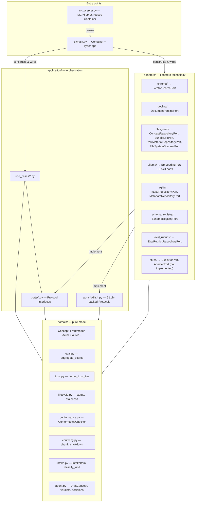

# Architecture Overview

The pipeline is a textbook **ports-and-adapters (hexagonal) architecture**
with four layers. Each layer has exactly one direction it's allowed to depend
in, enforced by convention (there's no dependency-checker tool wired in —
reviewers and `onboarding.md`'s rule of thumb are the enforcement).

## Layer by layer

### `domain/` — pure model, zero I/O

Everything here is a `@dataclass`, an `Enum`, or a pure function. No file
touches disk, the network, or a database, and nothing here imports from
`application/` or `adapters/`. This is the OKF concept model
(`concept.py`), the value objects the knowledge agent's skills produce
(`agent.py`), and standalone deterministic logic that would otherwise leak
into an LLM prompt or an adapter: quality-score aggregation (`eval.py`),
trust-tier derivation (`trust.py`), lifecycle/staleness rules
(`lifecycle.py`), structural conformance checks (`conformance.py`), markdown
chunking (`chunking.py`), and intake-state classification (`intake.py`). See
[Domain model](domain-model.md) for the full catalog.

### `application/` — ports and use cases

`application/ports/` declares what the application needs from the outside
world, as `typing.Protocol` classes — `ConceptRepositoryPort`,
`VectorSearchPort`, `MetadataRepositoryPort`, and so on, plus six LLM-backed
`Protocol`s under `ports/skills/` (extraction, disambiguation, type
classification, domain classification, quality eval, image captioning).
Protocols mean an adapter satisfies a port just by having the right method
signatures — no inheritance required.

`application/use_cases/` is where orchestration lives: `ScanIntake`,
`ParseSourceDocuments`, `KnowledgeAgent`, `IngestRawMaterial`, `IndexConcept`,
`RebuildIndex`, `SearchConcepts`, `ValidateConcept`, `AttestComputation`. Every
use case takes its collaborators as constructor arguments typed against
ports, and never imports a concrete adapter. See
[Use cases](../reference/use-cases.md) for what each one does.

### `adapters/` — concrete technology

One subpackage per backing technology, each implementing one or more ports:
ChromaDB for vector search, Docling for document parsing, the local
filesystem for the vault itself and the raw capture inbox, Ollama for every
LLM call (chat, vision, embeddings), stdlib `sqlite3` for the intake tracker
and structured metadata, and plain JSON files for schemas and eval rubrics.
`adapters/stubs/` holds `NotImplementedError` placeholders for the OKF §10
Attested Computation `Executor`/`Attester` ports — the seam exists, but no
concept in the vault uses it yet. See
[Ports & adapters](ports-and-adapters.md) for the full port → adapter
mapping.

### Entry points

`cli/main.py` is the **composition root**: its `Container` class is the only
place in the codebase that imports concrete adapter classes *and* the only
place that constructs a use case with real dependencies. Every Typer command
calls `_container()` (which reads `Settings.from_env()`) and drives one or
more use cases against it.

`mcp/server.py` is a second entry point serving the same vault to MCP
clients (Claude, or any other MCP-speaking tool) over Streamable HTTP. It
does not duplicate the wiring — it imports `Container` from `cli.main` and
reuses it, so both entry points always agree on which adapters are active.
See [MCP server](../reference/mcp-server.md).

## Why this shape

- **Testability without infrastructure.** `tests/application/` exercises
  every use case against hand-written in-memory fakes
  (`tests/application/fakes.py`) — no Ollama, ChromaDB, or SQLite needed to
  verify orchestration logic.
- **Swappable technology.** The module docstring on `cli/main.py`'s
  `Container` says it directly: swapping ChromaDB for another vector store
  later means writing one new adapter module and changing one line in
  `Container.__init__` — nothing in `application/` or `domain/` changes.
- **The vault stays the source of truth.** `ChromaVectorSearch` and
  `SqliteMetadataRepository` are derived indexes; `pipeline index`
  (`RebuildIndex`) can always regenerate them from the markdown files in
  `ConceptRepositoryPort`. Nothing here treats the index as authoritative.
