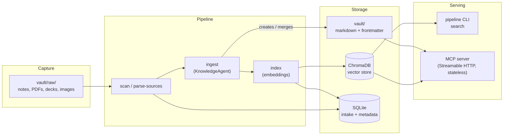

# OKF Pipeline

`pipeline` is the local-only ingestion, indexing, and knowledge-agent tool for
the OKF vault at `../vault` (format defined in the repo root's `WIKI_SPEC.md`).
It watches a capture inbox
(`vault/raw/`), turns unprocessed notes and documents into conformant OKF
concepts, indexes them for semantic search, and serves the result to MCP
clients such as Claude.

Everything runs locally: [Ollama](https://ollama.com) for LLM inference and
embeddings, [ChromaDB](https://www.trychroma.com/) for vector search, SQLite
for structured metadata, and plain markdown files for the vault itself. There
is no external API dependency and no cloud service in the loop.

## What it does, in one picture

## Where to go next

| I want to... | Read |
|---|---|
| Get it running for the first time | [Getting Started](getting-started.md) |
| Understand the codebase before changing it | [Developer Onboarding](onboarding.md) |
| See how the layers fit together | [Architecture → Overview](architecture/overview.md) |
| Look up a domain type or value object | [Architecture → Domain model](architecture/domain-model.md) |
| Find which adapter backs which port | [Architecture → Ports & adapters](architecture/ports-and-adapters.md) |
| Trace what happens end-to-end on `pipeline ingest` | [Architecture → Data flow](architecture/data-flow.md) |
| Look up a CLI command or flag | [Reference → CLI](reference/cli.md) |
| Connect Claude (or another MCP client) to the vault | [Reference → MCP server](reference/mcp-server.md) |
| Change an environment variable / local model | [Reference → Configuration](reference/configuration.md) |
| Understand one use case's contract | [Reference → Use cases](reference/use-cases.md) |
| Run or write tests | [Reference → Testing](reference/testing.md) |

## Design principles this codebase holds to

- **Hexagonal architecture, strictly.** `domain/` has no imports outside itself
  and no I/O. `application/` depends only on `domain/` and its own `ports/`
  (`Protocol` interfaces) — never on a concrete adapter. `adapters/` implement
  those ports against real local technology (Ollama, ChromaDB, SQLite, the
  filesystem, Docling). `cli/main.py` is the **composition root**: the one
  place concrete adapters get wired to ports. See
  [Architecture → Overview](architecture/overview.md).
- **Local-only, by design.** Every adapter talks to something running on the
  same machine. There is no adapter for a hosted LLM API in this codebase —
  intentionally, since the vault is meant to be inspectable and reproducible
  without a network dependency (see [Configuration](reference/configuration.md)).
- **The vault is the source of truth.** ChromaDB and SQLite are derived
  indexes, rebuildable at any time from the markdown files
  (`pipeline index`). Never treat them as authoritative.
- **Deterministic logic stays out of LLM calls.** Anything that can be decided
  by plain code — pass/fail thresholds, trust-tier derivation, staleness,
  chunking — is domain logic with no model in the loop
  (`domain/eval.py`, `domain/trust.py`, `domain/lifecycle.py`,
  `domain/chunking.py`). LLMs are reserved for the six judgment calls in
  `application/ports/skills/`.
