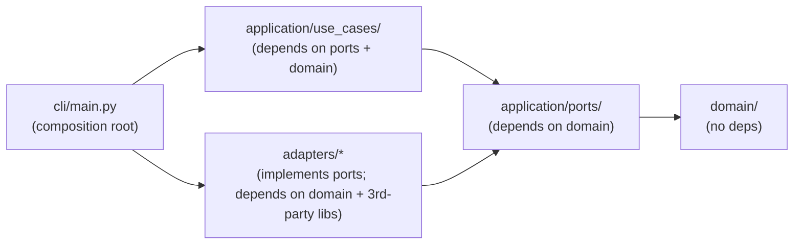

# Developer Onboarding

Read this before your first change. It's the map of the codebase and the
conventions the existing code already follows — matching them is more
valuable here than anywhere else, because the whole design bet is that
`domain/` and `application/` stay boring and swappable while `adapters/`
absorbs all the messy, technology-specific code.

If you haven't yet, read [Architecture → Overview](architecture/overview.md)
first — this page assumes you know the four-layer shape (domain → application
→ adapters → CLI composition root).

## Repository layout

```
pipeline/
├── src/pipeline/
│   ├── domain/            # pure value objects + pure functions, zero I/O, zero deps
│   ├── application/
│   │   ├── ports/          # Protocol interfaces the application depends on
│   │   │   └── skills/      # the six LLM-backed judgment calls, as ports
│   │   └── use_cases/       # orchestration — depends on ports, never on adapters
│   ├── adapters/           # concrete implementations of ports
│   │   ├── chroma/          # VectorSearchPort  → ChromaDB
│   │   ├── docling/         # DocumentParsingPort → Docling
│   │   ├── eval_rubrics/    # EvalRubricsRepositoryPort → JSON files
│   │   ├── filesystem/      # ConceptRepositoryPort, BundleLogPort, RawMaterialRepositoryPort, FileSystemScannerPort → local disk
│   │   ├── ollama/          # EmbeddingPort + all six skill ports → local Ollama
│   │   ├── schema_registry/ # SchemaRegistryPort → JSON Schema files
│   │   ├── sqlite/          # IntakeRepositoryPort, MetadataRepositoryPort → stdlib sqlite3
│   │   │   └── _thread_local_connection.py  # shared thread-safety helper (see below)
│   │   └── stubs/           # ExecutorPort, AttesterPort → NotImplementedError (OKF §10, unused so far)
│   ├── mcp/                # MCP server (Streamable HTTP) exposing the vault as tools
│   ├── cli/main.py         # composition root + Typer commands — the only file that imports every adapter
│   ├── config.py           # Settings.from_env() — the only place default paths/models/tunables are decided
│   └── logging_config.py   # configure_logging() — the only place logging is configured
├── schemas/                # JSON Schema per concept `type`, keyed by filename
├── evals/                  # quality-eval rubrics per domain (dev-side, not vault content)
├── tests/                  # mirrors src/pipeline/{domain,application,adapters}/
├── docs/                   # you are here
├── .env.example            # every Settings field, commented out with its default
├── Dockerfile              # builds an image that runs `pipeline mcp-serve`
└── mkdocs.yml
```

Two things worth flagging up front, since they're easy to get wrong by
analogy with a typical single-threaded CLI tool:

- **Every adapter with shared mutable state must be thread-safe.** The MCP
  server (`mcp/server.py`) builds one `Container` at import time and calls
  into it from tool functions that the `mcp` SDK runs on an `anyio`
  worker-thread pool — a different thread per call, not the thread that
  built the container. `sqlite3.Connection` objects are tied to the thread
  that created them, so both SQLite adapters go through
  `adapters/sqlite/_thread_local_connection.py::ThreadLocalSqliteConnection`
  (one connection per thread, opened lazily) instead of opening one
  connection in `__init__`. If you add a port backed by something with
  similar thread affinity, follow the same pattern rather than assuming
  single-threaded CLI usage.
- **Every `ConceptId` is treated as untrusted input at its boundary.**
  `MarkdownConceptRepository` turns a `ConceptId` straight into a filesystem
  path, and the MCP server's `get_concept` tool takes a `ConceptId` from a
  remote caller. `ConceptId.__post_init__` rejects `..`/absolute/backslash
  segments for exactly this reason (see `domain/concept.py`) — don't bypass
  it by building paths from raw strings instead of going through `ConceptId`.

## The rule that matters most: dependency direction



**`domain/` never imports `application/` or `adapters/`.** **`application/`
never imports `adapters/`** — it only knows about `Protocol` classes in
`application/ports/`. The only file allowed to import a concrete adapter
class *and* wire it to a use case is `cli/main.py`'s `Container`. `mcp/server.py`
is the one other place that imports `Container` directly, because it needs
the same wiring for a different transport (see
[Reference → MCP server](reference/mcp-server.md)) — it does not construct
adapters itself.

If you find yourself importing something from `pipeline.adapters.*` inside
`pipeline.application.*`, stop — that's the one dependency this codebase is
built to prevent, and it means either the port is missing a method or the
logic belongs in the adapter, not the use case.

## Conventions to follow

- **Every module starts with `from __future__ import annotations`.** Lets
  `Frontmatter | None`-style unions work regardless of runtime Python version
  quirks, and keeps dataclass field annotations lazy.
- **Domain value objects are `@dataclass(frozen=True)`** unless they're
  mutated in place as tracked state (`IntakeItem`, `Concept` — both plain
  `@dataclass`, because callers `replace()` them or mutate `.state` directly
  as they move through a repository).
- **Ports are `typing.Protocol`, not ABCs.** Adapters don't need to inherit
  from anything — structural typing means "implements the methods" is
  sufficient. Look at any file in `application/ports/` for the pattern.
- **Every port and every domain module has a one-paragraph module docstring**
  explaining *why* it exists and what it's deliberately not responsible for
  (see almost any file under `domain/` or `application/ports/` for the tone
  to match). Write one when you add a new port or domain module.
- **Use cases take their collaborators as constructor arguments**, typed as
  ports, and expose a single `run(...)` method. No use case reaches for a
  global, an env var, or a concrete adapter class.
- **The `Container` in `cli/main.py` is the only composition root.** Adding a
  new use case means: write it under `application/use_cases/`, instantiate it
  in `Container.__init__`, wire its dependencies from `self.*` attributes
  already on the container.
- **Log through `logging.getLogger(__name__)`, never `print`.** `typer.echo`
  stays reserved for a CLI command's user-facing result; anything about *how*
  the pipeline got there (a skill call, a per-item failure, a retry) is an
  operational log line — see [Configuration → Logging](reference/configuration.md#logging).
  Never call `logging.basicConfig` yourself; that's `logging_config.configure_logging()`'s
  job, called once per entry point.
- **A tunable knob is a `Settings` field, not a default parameter buried in
  an adapter or domain module.** If you catch yourself writing
  `def __init__(self, ..., some_threshold: float = 0.42)` for something a
  deployment might reasonably want to change, add it to `config.py` instead
  and thread it through `Container` — see
  [Configuration → Adding a new setting](reference/configuration.md#adding-a-new-setting).

## Common tasks

### Add a new CLI command

1. Add the use case (see below) if it doesn't exist yet, and wire it into
   `Container`.
2. Add a `@app.command()` function in `cli/main.py` that calls
   `_container()` and prints a human-readable summary — follow the shape of
   `search` or `validate` for a read-only command, or `ingest` for one that
   changes the vault and reports what happened.

### Add a new use case

1. Create `application/use_cases/<name>.py`. Constructor takes only ports
   (`Protocol` types from `application/ports/`), never concrete adapters.
   Expose `run(...)`.
2. If it needs a new capability no existing port covers, add the port first
   (see below) — don't reach into an adapter directly.
3. Add it to `Container.__init__` in `cli/main.py`, and (if user-facing) a CLI
   command.
4. Write a test in `tests/application/` using the in-memory fakes in
   `tests/application/fakes.py` — see [Reference → Testing](reference/testing.md).

### Add a new port + adapter

1. Define the `Protocol` in `application/ports/<name>.py` with a short
   docstring on the class explaining its responsibility and, if relevant, what
   it deliberately excludes (compare `application/ports/attester.py` vs.
   `application/ports/executor.py` for how narrowly these are scoped).
2. Implement it under `adapters/<technology>/<name>.py`. The adapter is the
   *only* place that imports the third-party library (`chromadb`, `docling`,
   `httpx`, `yaml`, `sqlite3`, ...) — see
   [Architecture → Ports & adapters](architecture/ports-and-adapters.md) for
   the existing pairing table.
3. Wire the concrete adapter into `Container.__init__` in `cli/main.py`.
4. Write a fake in `tests/application/fakes.py` (in-memory, no I/O) so use
   cases that depend on the port can be tested without the real adapter, and
   an adapter-level test in `tests/adapters/` that exercises the real thing
   (mark it `@pytest.mark.integration` if it needs Ollama).

### Add a new LLM-backed skill

Skills are ports too, under `application/ports/skills/`, each with exactly
one adapter under `adapters/ollama/skills/`. Follow the existing five for the
shape: a module-level `_PROMPT` template, a class taking `(OllamaClient,
model)`, one method that formats the prompt, calls
`client.generate_json(...)`, and maps the raw dict onto a `domain/agent.py`
verdict dataclass. Keep the **pass/fail or aggregation logic out of the
adapter** — that belongs in `domain/` (see how `quality_eval`'s adapter only
*scores*, while `domain/eval.py`'s `aggregate_scores` decides pass/fail).

### Add or change a concept `type`'s validation

Drop `<Type Name>.schema.json` into `pipeline/schemas/` — `JsonFileSchemaRegistry`
picks it up automatically by filename, no code change needed. It's validated
in addition to `_base.schema.json`'s always-on rules (see
`application/use_cases/validate_concept.py`). Run `pipeline validate <path>`
to check one concept.

### Add or change a domain's quality bar

Drop `<domain-id>.json` (an array of ADK-`Rubric`-shaped objects) into
`pipeline/evals/`, matching the domain concept's id
(e.g. `domains/coffee.json` for the `domains/coffee` concept). Falls back to
`evals/_base.json` for domains without their own file, or when a draft has no
resolved domain yet. These rubrics are dev-side quality-control data, not
vault/knowledge-base content — never link to them from a concept.

## Testing conventions

See [Reference → Testing](reference/testing.md) for the full picture; the
short version: `tests/domain/` and `tests/application/` use pure Python and
in-memory fakes (no real Ollama/ChromaDB/SQLite), `tests/adapters/` exercises
real adapters against temp dirs and, where a real LLM call is unavoidable,
marks the test `@pytest.mark.integration` so it skips cleanly when Ollama
isn't running.

**Any use case with a batch loop needs a failure-isolation test.**
`IngestRawMaterial` and `ParseSourceDocuments` both catch per-item exceptions
so one bad item doesn't abort the rest of the batch (see
[Architecture → Data flow](architecture/data-flow.md)) — if you add another
batch-style use case, give it the same isolation and the same kind of test:
`tests/application/test_ingest_raw_material.py::test_one_item_failing_unexpectedly_does_not_abort_the_batch`
is the template (a fake that raises for one specific item, asserting the
rest of the batch still completes).

## Linting and CI

```bash
uv run ruff check .
```

`pyproject.toml`'s `[tool.ruff]` section is the only linting config —
`.github/workflows/ci.yml` runs it plus `pytest` on every push/PR touching
`pipeline/`. Ollama isn't available in CI, so `@pytest.mark.integration`
tests skip there the same way they do locally without Ollama running (see
[Reference → Testing](reference/testing.md)) — CI is not a substitute for
running the full suite with Ollama up before a release.

## Where the OKF spec fits in

This tool exists to *produce* conformant OKF content, not to define the
format — `../WIKI_SPEC.md` at the repo root is the normative spec, and the
root `CLAUDE.md` has the load-bearing summary. When a domain type here
(`Concept`, `Frontmatter`, `Source`, `Generated`, `VerificationEvent`, `Actor`)
looks like it maps 1:1 onto a spec section, it does — see
[Architecture → Domain model](architecture/domain-model.md) for the exact
section references, kept as inline comments in the source too.
